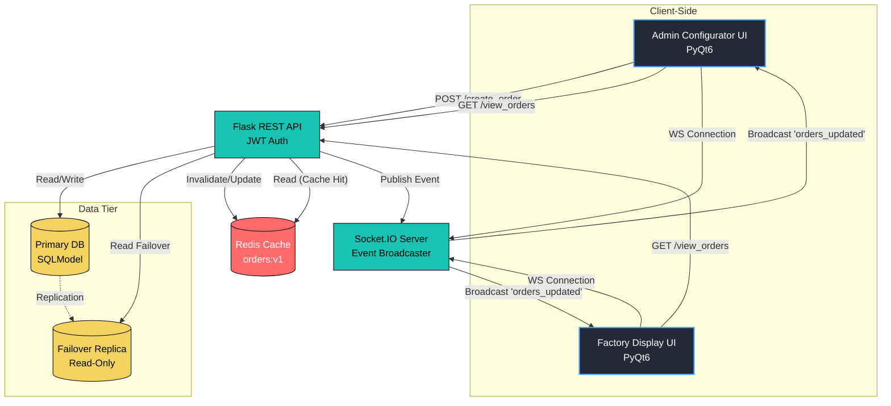
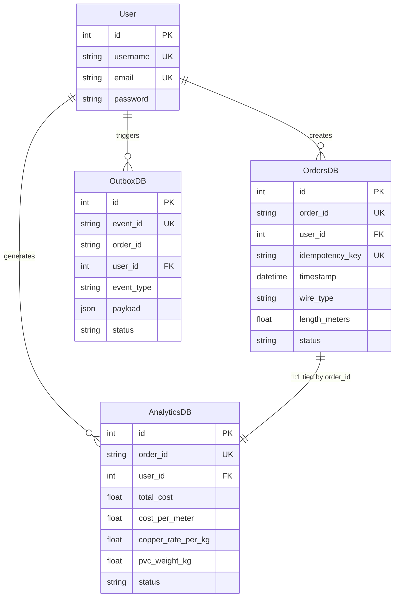
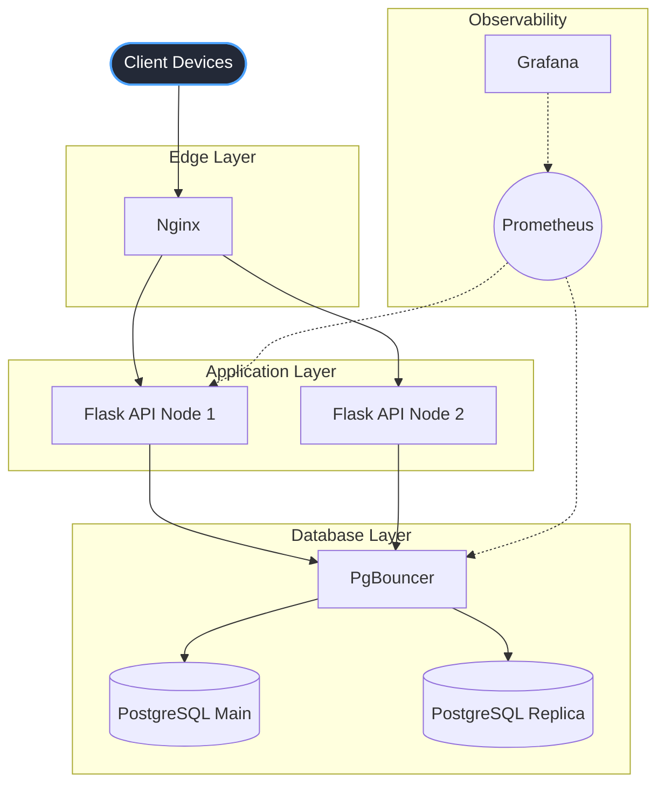

# WireDesk - Production Order Management System

WireDesk is a full-stack, distributed production management application designed for custom wire manufacturing. It features a PyQt6-based desktop application that interfaces with a highly scalable Flask REST API. The system enforces strict role-based access control, real-time factory floor synchronization via WebSockets, and a robust infrastructure designed to handle high-throughput manufacturing data.

---

# 🚀 Key Features

## Frontend (Desktop Client)

- **Role-Based UIs:** Distinct, native PyQt6 interfaces for Admin Configurator and Viewer Factory Display.
- **Dynamic Configuration Engine:** Auto-generates UI forms based on complex JSON product definitions and remote lookup tables.
- **Real-Time Dashboard:** Factory floor viewers receive instant, live UI updates of order statuses without manual refreshing.
- **Interactive Data Visualization:** Displays comprehensive analytics (e.g., copper rate, PVC weight, cost per meter) alongside standard order details.

## Backend (REST API & WebSockets)

- **Role-Based Access Control (RBAC):** JWT-based authentication enforcing strict read/write permissions at the route level.
- **Idempotent Operations:** Utilizes `X-Idempotency-Key` headers on order creation to prevent duplicate manufacturing runs during network retries.
- **Real-Time Event Broadcasting:** Socket.IO integration pushes state changes to connected clients instantly.
- **Transactional Outbox Pattern:** Ensures dual-write consistency between the SQL database and the WebSocket message broker.

## Infrastructure & Scalability

- **CQRS-Style Read/Write Splitting:** Write-heavy operations route to the Primary PostgreSQL database, while read-heavy dashboard views route to a read-only replica.
- **Distributed Caching:** Redis caches `/view_orders` endpoints, utilizing targeted invalidation when new orders are created or updated.
- **Connection Pooling:** Integrates PgBouncer to prevent database connection exhaustion during traffic spikes.
- **System Observability:** Prometheus integration continuously scrapes Node, API, and DB metrics for Grafana dashboard visualization.

---

### Architectural Flow
When a request enters the system, it follows a strict topology designed for high availability and process isolation:

1. **Edge Gateway (NGINX):** All client traffic (both PyQt6 Manager ordering apps and live Factory Displays) terminates at the NGINX reverse proxy. NGINX handles round-robin load balancing across the API cluster and maintains the HTTP `Upgrade` and `Connection` headers necessary to keep long-lived WebSocket tunnels alive.
2. **Application Cluster (Flask / Gunicorn / Eventlet):** Stateless API nodes process the core business logic and database mapping. By utilizing Eventlet, the Gunicorn workers can handle concurrent WebSocket connections asynchronously without blocking the main execution threads.
3. **Real-Time Backplane (Redis):** Because API nodes are horizontally scaled, client WebSocket connections are fragmented across the cluster. Redis acts as a Pub/Sub message broker. When a state mutation occurs on Node A, it is published to Redis, which instantaneously pushes the event to Node B so all connected edge displays remain synchronized regardless of which node they are attached to.
4. **Connection Pooling (PgBouncer):** Application nodes do not connect directly to the primary database. Write traffic is routed through PgBouncer operating in `transaction` mode. This multiplexes thousands of lightweight application virtual connections through a strictly limited pool of heavy physical PostgreSQL connections, preventing database Out-Of-Memory (OOM) failures under extreme load.
5. **Storage Tier (PostgreSQL Primary/Replica):** The physical storage layer is separated into a Primary node for ACID state mutations and a Replica node for read-only queries, synchronized asynchronously via Write-Ahead Logging (WAL).


## Repository Architecture

To enforce strict Separation of Concerns and ensure microservice-readiness, the codebase is decoupled into completely independent `client` and `server` environments. The infrastructure and orchestration configurations sit at the repository root.

```text
wiredesk/
├── .github/
│   └── workflows/
│       └── ci.yml                 # Automated pipeline for Flake8 linting and pytest
├── client/                        # The Edge Client (PyQt6 Desktop Apps)
│   ├── app.py                     # Entry point for the Manager's Configuration App
│   ├── display_app.py             # Entry point for the live Factory Floor Display
│   ├── network_sync.py            # Socket.IO client bridging PyQt6 to cloud WebSockets
│   ├── components/                # Reusable UI classes (Card, Overlay, Dashboard)
│   ├── assets/                    # Static UI resources (images, icons)
│   ├── data/                      # JSON schemas for dynamic configuration forms
│   └── lookup_table/              # Local manufacturing constants (tolerances, weights)
├── server/                        # The Application Cluster (Flask/Gunicorn)
│   ├── app.py                     # WSGI entry point and Application Factory
│   ├── requirements.txt           # Python dependencies for the Docker build
│   ├── api/                       # Flask Blueprints (HTTP routes & Socket.IO events)
│   ├── controllers/               # Core Business Logic (Math Engine & Transactional Outbox)
│   ├── models/                    # SQLAlchemy ORM definitions (PostgreSQL schema mapping)
│   ├── extensions/                # Infrastructure wiring (SQLAlchemy, SocketIO, JWT)
│   ├── utils/                     # Custom RBAC decorators and middleware
│   ├── metrics.py                 # Prometheus telemetry (Counters, Histograms)
│   └── tests/                     # Automated unit and integration testing suite
├── compose.yaml                   # Docker Compose orchestrator for the distributed stack
├── Dockerfile                     # Multi-stage containerization script for API nodes
├── nginx.conf                     # Reverse Proxy config (Load Balancing + WebSockets)
├── prometheus.yml                 # Scraper configuration mapping to API metric endpoints
└── alerts.yml                     # Alertmanager rules for triggering automated alarms
```

# 🏗️ System Design & Architecture

The architecture of WireDesk is designed to prioritize high availability, strict data consistency, and real-time responsiveness.

## 1. High-Level System Architecture



**Architectural Note:** Notice how the API gateway routes cached GET requests to Redis while real-time updates rely on a transactional outbox pattern to ensure reliable WebSocket delivery.

---

## 2. Database Schema (Entity Relationship)



---

## 3. Scalable Infrastructure Topology


**Architectural Note:** PgBouncer pools PostgreSQL connections to prevent connection exhaustion, while Prometheus continuously scrapes metrics for Grafana dashboards.

---

## 4. Request Lifecycle

```mermaid
sequenceDiagram
    autonumber

    actor Client
    participant Nginx
    participant API
    participant Redis
    participant PgBouncer
    participant Main
    participant Replica

    rect rgb(35,41,55)
        Note over Client,Replica: Viewing Orders

        Client->>Nginx: GET /view_orders
        Nginx->>API: Route request
        API->>Redis: Check Cache

        alt Cache Miss
            Redis-->>API: Null
            API->>PgBouncer: SELECT
            PgBouncer->>Replica: Execute Query
            Replica-->>PgBouncer: Data
            PgBouncer-->>API: Response
            API->>Redis: Cache Response
        else Cache Hit
            Redis-->>API: Cached JSON
        end

        API-->>Client: Orders
    end

    rect rgb(45,53,69)
        Note over Client,Replica: Creating Order

        Client->>Nginx: POST /create_order
        Nginx->>API: Route request
        API->>PgBouncer: BEGIN
        PgBouncer->>Main: INSERT
        Main-->>PgBouncer: COMMIT
        PgBouncer-->>API: Success
        Main-)Replica: WAL Replication
        API->>Redis: Invalidate Cache
        API-->>Client: 201 Created
    end
```



**Architectural Note:** Read-heavy traffic is served from Redis or the PostgreSQL replica, while write operations are committed only to the primary database before cache invalidation.


